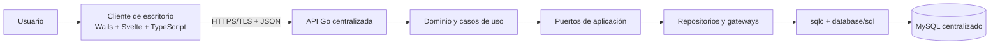

# Sistema-GuriMAX

Sistema POS e inventario para **Provisiones Gurima**, diseñado para centralizar ventas, pagos, caja, inventario, compras, crédito, devoluciones, facturación, reportes y auditoría.

> GuriMAX se diseña como un monolito modular: el cliente de escritorio consume una API centralizada en Go y únicamente la API tiene acceso a MySQL.

## Estado del proyecto

El repositorio se encuentra en la fase de **fundación de persistencia y arquitectura**. La migración inicial, el esquema MySQL, las consultas de lectura, la configuración de sqlc, el entorno local con Docker Compose y la documentación técnica ya están preparados. La capa de casos de uso, repositorios de infraestructura, adaptadores HTTP y la integración final del cliente se implementarán sobre esta base.

| Área | Estado | Descripción |
|---|---|---|
| Modelo de datos | Preparado | Esquema modular MySQL con restricciones, índices y datos maestros iniciales. |
| Migraciones | Preparado | Migración inicial reversible para desarrollo y pruebas. |
| Consultas SQL | Preparado | Consultas tipadas para catálogo, ventas y operaciones. |
| Código generado | Preparado | Código Go generado mediante sqlc en `backend/db/generated/sqlc`. |
| Entorno local | Preparado | MySQL mediante Docker Compose, volumen persistente y healthcheck. |
| Repositorios y casos de uso | Siguiente fase | Deben implementar los puertos de Clean Architecture. |
| Cliente y API funcional | Siguiente fase | La estructura está prevista; la lógica de negocio aún debe completarse. |

## Arquitectura

La solución separa la interfaz, la aplicación, el dominio y la infraestructura. Las dependencias deben apuntar hacia las reglas de negocio, no desde el dominio hacia MySQL o hacia el framework de interfaz.



### Principios principales

- El cliente no se conecta directamente a MySQL ni contiene credenciales de base de datos.
- El dominio no depende de SQL, sqlc, `database/sql`, Wails o Svelte.
- Los casos de uso coordinan las operaciones y aplican autorización, validaciones y reglas de negocio.
- Los repositorios implementan interfaces definidas por la aplicación y traducen tipos sqlc a modelos de dominio o aplicación.
- Las operaciones que modifican venta, caja, inventario, crédito, comprobantes o auditoría deben ejecutarse dentro de una unidad transaccional.
- Los saldos no se corrigen silenciosamente; las diferencias deben quedar representadas mediante movimientos compensatorios y auditoría.

## Stack tecnológico

| Componente | Tecnología | Responsabilidad |
|---|---|---|
| Cliente de escritorio | Wails | Empaquetar la aplicación de escritorio. |
| Interfaz | Svelte + TypeScript | Pantallas POS, administración, reportes y operación. |
| Backend | Go | API, casos de uso, dominio y coordinación transaccional. |
| Persistencia | MySQL | Fuente central de verdad para los datos operativos. |
| Acceso SQL | `database/sql` + sqlc | Consultas SQL verificadas y código Go tipado. |
| Migraciones | SQL versionado compatible con golang-migrate | Evolución reproducible del esquema. |
| Entorno local | Docker Compose | Ejecutar MySQL de forma reproducible durante el desarrollo. |

## Estructura del repositorio

```text
Guri_MAX/
├── backend/
│   ├── cmd/api/                  # Punto de entrada previsto para la API Go
│   ├── db/
│   │   ├── generated/sqlc/       # Código generado; no editar manualmente
│   │   ├── migrations/           # Migraciones SQL versionadas
│   │   └── queries/              # Consultas SQL agrupadas por capacidad
│   ├── docker-compose.yml        # MySQL local y configuración de desarrollo
│   ├── sqlc.yaml                 # Configuración de generación sqlc
│   └── go.mod                    # Módulo y dependencias Go
├── documentation/
│   ├── Clean_Architecture.pdf
│   ├── Definicion_Proyecto_GuriMAX.pdf
│   ├── Explicacion_Clean_Architecture.pdf
│   ├── Stack_Tecnologico.pdf
│   ├── GuriMAX_datos_confiables_y_arquitectura_evolutiva.pdf
│   ├── Implementacion_Base_Datos.md
│   └── Validacion_Consultas_y_Clean_Architecture.md
└── README.md
```

## Requisitos de desarrollo

Para trabajar con el proyecto se recomienda contar con los siguientes componentes instalados y disponibles en el PATH:

| Requisito | Uso |
|---|---|
| Git | Control de versiones y colaboración. |
| Go | Compilar el backend y ejecutar pruebas. |
| Docker Desktop | Ejecutar MySQL local mediante Compose. |
| sqlc v1.31.1 | Validar consultas y generar código Go. |
| Node.js y pnpm/npm | Instalar y construir el cliente Svelte cuando esa capa esté habilitada. |
| Wails | Ejecutar y empaquetar la aplicación de escritorio. |

## Puesta en marcha de la base de datos local

Desde la raíz del repositorio, inicia el servicio MySQL con Docker Compose:

```bash
cd backend
docker compose up -d
```

El Compose utiliza un volumen persistente denominado `mysql_data`, un healthcheck y una red local. El puerto se enlaza a `127.0.0.1`, por lo que la instancia se mantiene accesible únicamente desde el equipo de desarrollo.

La migración inicial se ejecuta automáticamente cuando se crea el volumen por primera vez. Si necesitas reinicializar completamente la base local durante desarrollo, elimina el volumen de Compose teniendo presente que esta operación borra sus datos:

```bash
docker compose down -v
docker compose up -d
```

No utilices contraseñas del entorno local en producción. Las credenciales de producción deben configurarse mediante secretos del entorno de despliegue y la API debe conectarse a MySQL a través de una red privada.

## Generación y validación de sqlc

La configuración de sqlc se encuentra en `backend/sqlc.yaml`. El esquema se obtiene de la migración inicial y las consultas se toman desde `backend/db/queries`.

```bash
cd backend
sqlc generate
sqlc vet
```

El resultado se genera en `backend/db/generated/sqlc`. Estos archivos son artefactos derivados: cuando se modifique una consulta o el esquema, se debe ejecutar nuevamente `sqlc generate` y revisar el diff; no se deben editar manualmente.

Las consultas actuales se agrupan de la siguiente forma:

| Archivo | Cobertura |
|---|---|
| `db/queries/catalog.sql` | Búsqueda por código, catálogo, stock mínimo y lotes próximos a vencer. |
| `db/queries/sales.sql` | Detalle de ventas, líneas, pagos, idempotencia y reportes por período. |
| `db/queries/operations.sql` | Caja, cuentas por pagar, crédito y auditoría. |

Las consultas de lectura no reemplazan los casos de uso. La finalización de una venta debe recalcular importes, verificar permisos, caja, inventario y crédito, registrar movimientos y confirmar todo mediante `COMMIT` o revertirlo con `ROLLBACK`.

## Modelo de datos

El esquema está organizado por capacidades de negocio:

| Módulo | Tablas principales | Responsabilidad |
|---|---|---|
| Identidad | `roles`, `permissions`, `users`, `sessions` | Usuarios, roles, permisos y sesiones revocables. |
| Catálogo | `categories`, `units`, `products`, `product_barcodes`, `product_lots`, `suppliers` | Productos, precios, costos, códigos, proveedores y vencimientos. |
| Clientes y crédito | `customers`, `credit_accounts`, `credit_entries` | Límites, cargos, abonos y vencimientos. |
| POS | `sales`, `sale_lines`, `sale_payments` | Ventas, instantáneas históricas, pagos múltiples y cambio. |
| Caja | `cash_registers`, `cash_sessions`, `cash_movements` | Apertura, cobros, retiros, cierres y diferencias. |
| Inventario | `inventory_balances`, `stock_movements`, `inventory_counts` | Existencias, reservas, conteos, ajustes y mermas. |
| Compras | `purchases`, `purchase_receipts`, `purchase_incidents`, `payables` | Compras, recepción parcial, incidencias y obligaciones. |
| Devoluciones | `sales_returns`, `sales_return_lines`, `refunds` | Solicitud, aprobación, condición y reembolso. |
| Facturación | `tax_policies`, `billing_sequences`, `billing_documents` | Políticas fiscales, secuencias y comprobantes. |
| Control operativo | `audit_log`, `idempotency_keys`, `backup_jobs`, `system_settings` | Auditoría, reintentos, respaldos y configuración. |

Los importes monetarios se almacenan en centavos mediante columnas `*_cents`. Las fechas técnicas usan `DATETIME(6)` y las fechas de negocio se conservan en columnas específicas como `business_date` o `due_date`. La moneda operativa inicial es `DOP`.

## Clean Architecture: siguiente fase

La capa siguiente debe mantener las interfaces en la aplicación y los adaptadores concretos en infraestructura:

```text
backend/internal/
├── platform/
│   ├── mysql/              # Conexión, configuración y healthcheck
│   ├── transaction/       # TransactionManager o UnitOfWork
│   ├── clock/             # Reloj inyectable para pruebas
│   └── id/                # Generación de identificadores
├── modules/
│   ├── catalog/
│   │   ├── domain/
│   │   ├── application/ports/
│   │   └── infrastructure/mysql/
│   ├── sales/
│   │   ├── domain/
│   │   ├── application/commands/
│   │   ├── application/queries/
│   │   ├── application/ports/
│   │   └── infrastructure/mysql/
│   ├── inventory/
│   └── cash/
└── shared/domain/
```

El orden recomendado de implementación es `Login`, `SearchProducts`, `OpenCashSession`, `CompleteSale`, `ReceivePurchase`, ajustes de inventario, pagos de crédito, devoluciones y cierre de caja. `CompleteSale` debe coordinar `InventoryGateway`, `CashGateway`, `CreditGateway`, `AuditWriter` y el proveedor de comprobantes dentro de una única transacción.

## Convenciones de datos y seguridad

Los importes deben manejarse como enteros en centavos u objetos de valor monetario; no se debe utilizar `float64` para calcular dinero. Las cantidades `DECIMAL` que sqlc genera como texto deben convertirse y validarse en el mapeador del repositorio antes de llegar al dominio.

Las claves de idempotencia deben comprobarse junto con el contenido de la solicitud. Si una clave se reutiliza con un payload diferente, la API debe rechazar la operación. Las acciones sensibles deben registrar actor, rol, motivo, autorización relacionada, entidad afectada y correlación en `audit_log`.

Las migraciones no deben insertar productos, clientes, saldos históricos ni existencias inventadas. Esa información debe cargarse mediante un proceso de migración aprobado, con revisión de duplicados y saldos inconsistentes antes de activar producción.

## Pruebas y validación

La validación mínima de cada cambio de persistencia es:

```bash
cd backend
sqlc generate
sqlc vet
go test ./...
go vet ./...
```

Cuando Docker Desktop esté disponible, se deben añadir pruebas de integración que levanten MySQL y cubran rollback, unicidad de códigos, bloqueo de sesiones de caja, recepción parcial, inventario negativo explícito, crédito, devoluciones, idempotencia y auditoría.

## Flujo de trabajo Git

La rama principal del repositorio es `main`. Para subir cambios:

```bash
git status
git add .
git commit -m "tipo: describe brevemente el cambio"
git pull --rebase origin main
git push
```

Antes de hacer commit, revisa los archivos preparados para evitar subir secretos, contraseñas reales, archivos temporales o artefactos no relacionados:

```bash
git diff --cached --stat
git diff --cached --name-only
```

## Documentación relacionada

- [Implementación de la base de datos](documentation/Implementacion_Base_Datos.md)
- [Validación de consultas y Clean Architecture](documentation/Validacion_Consultas_y_Clean_Architecture.md)
- [Definición del proyecto](documentation/Definicion_Proyecto_GuriMAX.pdf)
- [Stack tecnológico](documentation/Stack_Tecnologico.pdf)
- [Clean Architecture](documentation/Clean_Architecture.pdf)
- [Explicación de Clean Architecture](documentation/Explicacion_Clean_Architecture.pdf)
- [GuriMAX: datos confiables y arquitectura evolutiva](documentation/GuriMAX_datos_confiables_y_arquitectura_evolutiva.pdf)

## Referencias externas

- [sqlc: Getting started with MySQL](https://docs.sqlc.dev/en/latest/tutorials/getting-started-mysql.html)
- [MySQL 9.7: InnoDB Transaction Model](https://dev.mysql.com/doc/refman/9.7/en/innodb-transaction-model.html)
- [MySQL: START TRANSACTION, COMMIT y ROLLBACK](https://dev.mysql.com/doc/en/commit.html)
- [Wails: integración con SvelteKit](https://wails.io/docs/guides/sveltekit/)

## Licencia

La licencia del proyecto debe definirse por los responsables de GuriMAX antes de publicar una versión distribuible. Mientras no exista un archivo `LICENSE`, todos los derechos sobre el código y la documentación permanecen reservados a sus respectivos propietarios.
